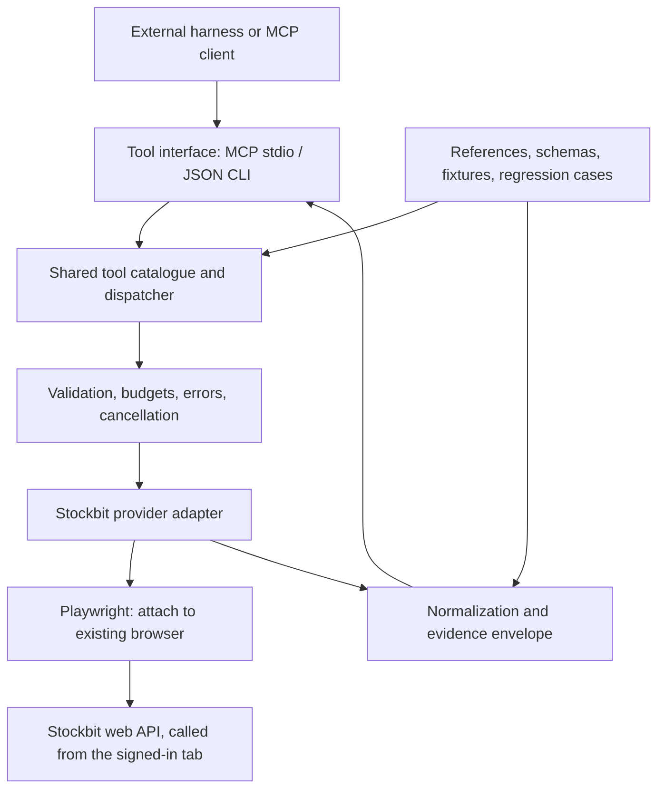

# SohiB tool-provider architecture

SohiB supplies research tools to external agent harnesses. The harness owns the model, the
reasoning loop, conversation state and scheduling; SohiB owns the tool catalogue, validation,
browser attachment, normalization and the evidence envelope. The shared tool service and MCP
stdio transport are implemented; see [setup and client verification](mcp-tools.md).



## Components

| Component | Role |
|---|---|
| `docs/stockbit/` | Canonical provider references and catalogue; distinguish observations from guarantees |
| `stockbit/contracts.py` | Validated research arguments and normalized result contract |
| `stockbit/provider.py` | Reusable dispatch/normalization boundary, independent of model choices |
| `stockbit/search.py`, `normalize.py` | Identity, instrument filtering, values, unknowns |
| `stockbit/browser.py`, `playwright_worker.py` | Existing-browser connection, operation ownership, bounded retrieval |
| Fixtures and tests | Synthetic regression cases and optional local historical evidence |

## Implemented interfaces

Fixture and disabled modes advertise three tools (`search_companies`,
`get_key_statistics`, and `list_metrics`); browser mode advertises thirteen over the
in-page fetch transport ([ADR 006](decisions/006-in-page-fetch-transport.md)). Tool
descriptions include scope, available namespaces, examples, limits, and failure behavior.
Do not advertise catalogue entries that lack an implemented, live-verified adapter.

Return the existing envelope intact: records, provenance, pagination, warnings,
and structured errors. Map it into the selected transport's tool-result shape.
Transport/protocol errors and valid tool executions that report domain errors need
distinct handling. Normalized data remains untrusted evidence to the consuming model.

Implemented code boundaries:

```text
sohib/
  tools/
    config.py       # tool-only configuration; no model credentials
    catalogue.py    # portable tool descriptions and schemas
    service.py      # shared call boundary
  interfaces/
    mcp_server.py   # local stdio transport
    mcp_smoke.py    # separate-process client verification
  stockbit/
    api_routes.py   # allowlisted routes and screen body constants
    browser.py      # attach to the user's browser, bounded worker, locking
    playwright_worker.py  # static in-page fetch and error mapping
    adapters.py     # per-tool orchestration
    normalize.py, financials.py, events.py, search.py  # normalizers
  onboarding.py     # sohib setup / connect / doctor / config
```

## Local first

MCP stdio lets the client run a local tool-server subprocess and communicate through
standard streams. Protocol stdout must contain only protocol messages; diagnostics
belong on stderr. See the [MCP stdio specification](https://github.com/modelcontextprotocol/modelcontextprotocol/blob/main/docs/specification/2026-07-28/basic/transports/stdio.mdx).

The recorded compatibility tests used MCP SDK 2.2.0; the package accepts
`mcp>=2.2,<3`, and protocol negotiation is handled by that SDK. Neither the SDK nor
a single protocol revision is exactly pinned. Publication of a protocol revision
does not establish that every installed harness supports it. Clients that need an
extension, plugin or CLI wrapper get a small adapter
that reuses the shared service; the OpenClaw bridge is the example.

Remote HTTP, multi-user deployment, browser access across hosts, credentials and
server authentication are out of scope for this design. The browser attachment works
locally and fails explicitly when its configured session is unavailable.
